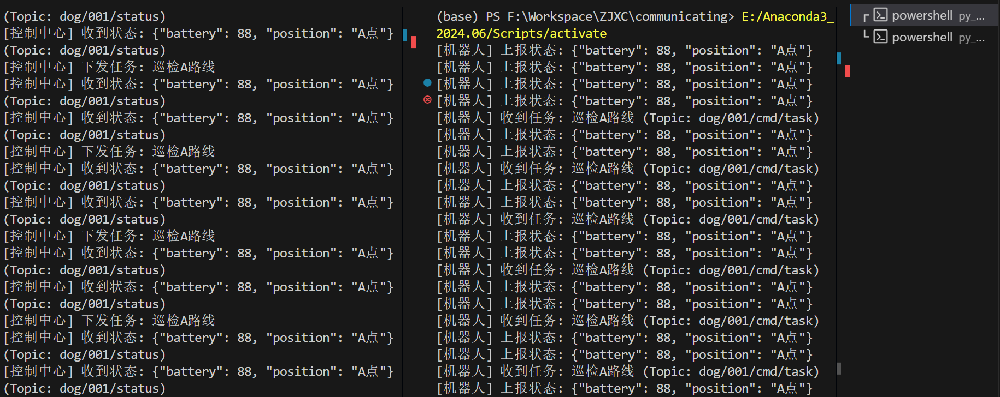

# 项目内容
搭建简易的传输平台验证 MQTT 双向通信，Python版本

# 项目结构
```plaintext
mqtt_demo/
│── requirements.txt
│── robot.py          # 模拟机器狗（订阅任务，发布状态）
│── control.py        # 模拟控制中心（发布任务，订阅状态）
└── readme.md
```

# 前期准备
需要先安装 Paho MQTT Python 库，可以使用 pip：
```bash
pip install -r requirements.txt
```
聪明的你当然可以使用anconda来管理本项目的环境
```bash
conda create -n mqtt_demo python=3.8
conda activate mqtt_demo
pip install -r requirements.txt
```

# 运行
- 在windows/Linux下，分别在两个终端中运行：
    ```bash
    python robot.py
    ```
    ```bash
    python control.py
    ```


# 运行结果


# Note
- 本次验证采用的是公共开放的 MQTT 服务器，因此转发的速度可能首公共服务器的状态影响，日后如需进一步优化，应搭建私有的 MQTT 服务器。
- 目前的验证只局限于基本的消息发布和订阅功能，未来可以扩展更多的功能和场景。

# 提升
修改 Broker 地址：可以使用云服务商的 MQTT 托管服务（如阿里云 IoT）