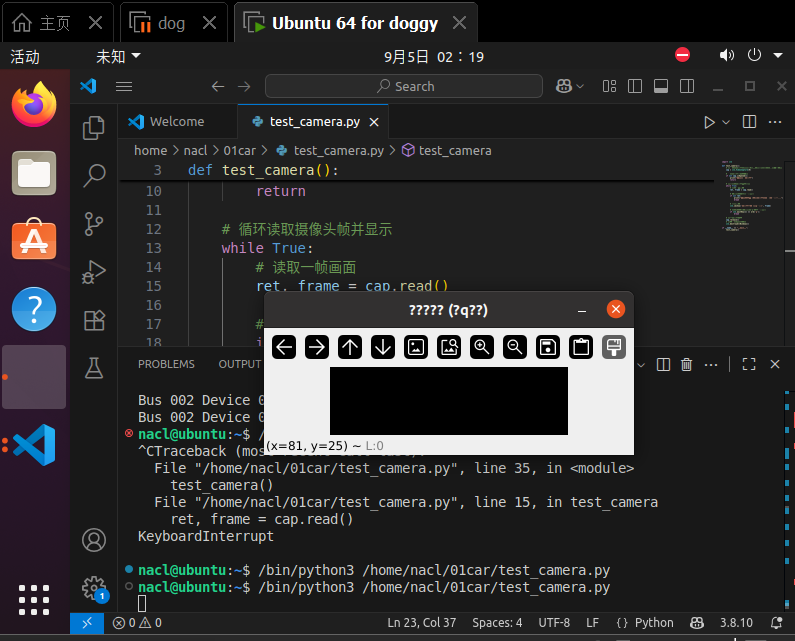

# 配置虚拟机摄像头
- 终端中安装opencv
    ```bash
    pip install opencv-python
    ```
- 调试虚拟机摄像头
参考https://blog.csdn.net/u012005313/article/details/82146385
使用测试例程
    ```python
    import cv2

    def test_camera():
        # 打开默认摄像头（通常是0，也可能是1等，取决于系统配置）
        cap = cv2.VideoCapture(0)
        
        # 检查摄像头是否成功打开
        if not cap.isOpened():
            print("无法打开摄像头")
            return
        
        # 循环读取摄像头帧并显示
        while True:
            # 读取一帧画面
            ret, frame = cap.read()
            
            # 如果读取失败，退出循环
            if not ret:
                print("无法接收帧 (可能摄像头已断开)。退出中...")
                break
            
            # 显示画面
            cv2.imshow('摄像头测试 (按q退出)', frame)
            
            # 等待1毫秒，如果按下'q'键则退出循环
            if cv2.waitKey(1) == ord('q'):
                break
        
        # 释放摄像头资源
        cap.release()
        # 关闭所有OpenCV窗口
        cv2.destroyAllWindows()

    if __name__ == "__main__":
        test_camera()
    ``` 
- 出现

择日再议，cao！本机运行是好的啊
- 解决

由于窗口标题出现了中文，导致无法显示，改为英文即可
**至此摄像头调试完成**

# 部署MQTT服务器
https://docs.emqx.com/zh/emqx/latest/deploy/install-ubuntu.html
在该网址中按照指示安装emqx，但是在
```bash
sudo apt-get install emqx
```
出现
```bash
nacl@ubuntu:~$ curl -s https://packagecloud.io/install/repositories/emqx/emqx-enterprise5/script.deb.sh | sudo bash
Detected operating system as Ubuntu/focal.
Checking for curl...
Detected curl...
Checking for gpg...
Detected gpg...
Detected apt version as 2.0.9
Running apt-get update... done.
Installing apt-transport-https... done.
Installing /etc/apt/sources.list.d/emqx_emqx-enterprise5.list...done.
Importing packagecloud gpg key... Packagecloud gpg key imported to /etc/apt/keyrings/emqx_emqx-enterprise5-archive-keyring.gpg
done.
Running apt-get update... done.

The repository is setup! You can now install packages.
nacl@ubuntu:~$ sudo apt-get install emqx
正在读取软件包列表... 完成
正在分析软件包的依赖关系树       
正在读取状态信息... 完成       
E: 无法定位软件包 emqx
```
- 解决：
更换为
```bash
sudo apt-get install emqx-enterprise
```
- 出现：
```bash
nacl@ubuntu:~$ sudo apt-get install emqx-enterprise
正在读取软件包列表... 完成
正在分析软件包的依赖关系树       
正在读取状态信息... 完成       
将会同时安装下列软件：
  libodbc1
建议安装：
  libmyodbc odbc-postgresql tdsodbc unixodbc-bin
下列【新】软件包将被安装：
  emqx-enterprise libodbc1
升级了 0 个软件包，新安装了 2 个软件包，要卸载 0 个软件包，有 67 个软件包未被升级。
需要下载 60.1 MB 的归档。
解压缩后会消耗 113 MB 的额外空间。
您希望继续执行吗？ [Y/n] y
获取:2 http://us.archive.ubuntu.com/ubuntu focal-updates/main amd64 libodbc1 amd64 2.3.6-0.1ubuntu0.1 [190 kB]
获取:1 https://packagecloud.io/emqx/emqx-enterprise5/ubuntu focal/main amd64 emqx-enterprise amd64 5.10.0 [59.9 MB]
已下载 60.1 MB，耗时 9秒 (6,507 kB/s)                                                                                                    
正在选中未选择的软件包 libodbc1:amd64。
(正在读取数据库 ... 系统当前共安装有 175778 个文件和目录。)
准备解压 .../libodbc1_2.3.6-0.1ubuntu0.1_amd64.deb  ...
正在解压 libodbc1:amd64 (2.3.6-0.1ubuntu0.1) ...
正在选中未选择的软件包 emqx-enterprise。
准备解压 .../emqx-enterprise_5.10.0_amd64.deb  ...
正在解压 emqx-enterprise (5.10.0) ...
正在设置 libodbc1:amd64 (2.3.6-0.1ubuntu0.1) ...
正在设置 emqx-enterprise (5.10.0) ...
正在添加组"emqx" (GID 135)...
完成。
正在添加系统用户"emqx" (UID 129)...
正在将新用户"emqx" (UID 129)添加到组"emqx"...
无法创建主目录"/var/lib/emqx"。
● ubuntu
    State: degraded
     Jobs: 0 queued
   Failed: 1 units
    Since: Wed 2025-09-10 02:17:16 PDT; 22h ago
   CGroup: /
           ├─user.slice 
           │ └─user-1000.slice 
           │   ├─user@1000.service …
           │   │ ├─gsd-xsettings.service 
           │   │ │ └─1870 /usr/libexec/gsd-xsettings
           │   │ ├─gvfs-goa-volume-monitor.service 
           │   │ │ └─1530 /usr/libexec/gvfs-goa-volume-monitor
           │   │ ├─gsd-power.service 
           │   │ │ └─1820 /usr/libexec/gsd-power
           │   │ ├─xdg-permission-store.service 
           │   │ │ └─1734 /usr/libexec/xdg-permission-store
           │   │ ├─xdg-document-portal.service 
           │   │ │ └─1974 /usr/libexec/xdg-document-portal
           │   │ ├─xdg-desktop-portal.service 
           │   │ │ └─2077 /usr/libexec/xdg-desktop-portal
           │   │ ├─gsd-sound.service 
           │   │ │ └─1855 /usr/libexec/gsd-sound
           │   │ ├─gsd-rfkill.service 
           │   │ │ └─1824 /usr/libexec/gsd-rfkill
           │   │ ├─gsd-usb-protection.service 
           │   │ │ └─1856 /usr/libexec/gsd-usb-protection
           │   │ ├─gsd-print-notifications.service 
           │   │ │ ├─1822 /usr/libexec/gsd-print-notifications
           │   │ │ └─1925 /usr/libexec/gsd-printer
           │   │ ├─evolution-calendar-factory.service 
           │   │ │ └─1754 /usr/libexec/evolution-calendar-factory
           │   │ ├─gsd-a11y-settings.service 
           │   │ │ └─1803 /usr/libexec/gsd-a11y-settings
           │   │ ├─gsd-wwan.service 
           │   │ │ └─1864 /usr/libexec/gsd-wwan
           │   │ ├─pulseaudio.service 
           │   │ │ └─1475 /usr/bin/pulseaudio --daemonize=no --log-target=journal
           │   │ ├─gsd-screensaver-proxy.service 
           │   │ │ └─1825 /usr/libexec/gsd-screensaver-proxy
           │   │ ├─gsd-media-keys.service 
           │   │ │ └─1818 /usr/libexec/gsd-media-keys
           │   │ ├─gvfs-daemon.service 
           │   │ │ ├─1501 /usr/libexec/gvfsd
           │   │ │ ├─1506 /usr/libexec/gvfsd-fuse /run/user/1000/gvfs -f -o big_writes
           │   │ │ └─1792 /usr/libexec/gvfsd-trash --spawner :1.3 /org/gtk/gvfs/exec_spaw/0
           │   │ ├─snap.snap-store.snap-store-21607262-cea0-4340-90b9-2704de7faf49.scope 
           │   │ │ └─1952 /snap/snap-store/638/usr/bin/snap-store --gapplication-service
           │   │ ├─evolution-source-registry.service 
           │   │ │ └─1745 /usr/libexec/evolution-source-registry
           │   │ ├─gvfs-udisks2-volume-monitor.service 
           │   │ │ └─1512 /usr/libexec/gvfs-udisks2-volume-monitor
           │   │ ├─gsd-sharing.service 
           │   │ │ └─1843 /usr/libexec/gsd-sharing
           │   │ ├─init.scope 
           │   │ │ ├─1469 /lib/systemd/systemd --user
           │   │ │ └─1470 (sd-pam)
           │   │ ├─gsd-smartcard.service 
           │   │ │ └─1850 /usr/libexec/gsd-smartcard
           │   │ ├─gsd-housekeeping.service 
           │   │ │ └─1807 /usr/libexec/gsd-housekeeping
           │   │ ├─gsd-wacom.service 
           │   │ │ └─1862 /usr/libexec/gsd-wacom
           │   │ ├─gvfs-gphoto2-volume-monitor.service 
           │   │ │ └─1520 /usr/libexec/gvfs-gphoto2-volume-monitor
           │   │ ├─gnome\x2dsession\x2dmanager.slice 
           │   │ │ └─gnome-session-manager@ubuntu.service 
           │   │ │   ├─1675 /usr/libexec/gnome-session-binary --systemd-service --session=ubuntu
           │   │ │   ├─1839 /usr/libexec/gsd-disk-utility-notify
           │   │ │   ├─1849 /usr/bin/vmtoolsd -n vmusr --blockFd 3
           │   │ │   ├─1879 /usr/libexec/evolution-data-server/evolution-alarm-notify
           │   │ │   └─2797 update-notifier
           │   │ ├─gnome-session-monitor.service 
           │   │ │ └─1668 /usr/libexec/gnome-session-ctl --monitor
           │   │ ├─gsd-datetime.service 
           │   │ │ └─1806 /usr/libexec/gsd-datetime
           │   │ ├─xdg-desktop-portal-gtk.service 
           │   │ │ └─2081 /usr/libexec/xdg-desktop-portal-gtk
           │   │ ├─gnome-shell-x11.service 
           │   │ │ ├─1689 /usr/bin/gnome-shell
           │   │ │ ├─1708 ibus-daemon --panel disable --xim
           │   │ │ ├─1712 /usr/libexec/ibus-memconf
           │   │ │ ├─1713 /usr/libexec/ibus-extension-gtk3
           │   │ │ ├─1717 /usr/libexec/ibus-x11 --kill-daemon
           │   │ │ └─1860 /usr/libexec/ibus-engine-simple
           │   │ ├─at-spi-dbus-bus.service 
           │   │ │ ├─1657 /usr/libexec/at-spi-bus-launcher
           │   │ │ ├─1662 /usr/bin/dbus-daemon --config-file=/usr/share/defaults/at-spi2/accessibility.conf --nofork --print-address 3
           │   │ │ └─1730 /usr/libexec/at-spi2-registryd --use-gnome-session
           │   │ ├─apps.slice 
           │   │ │ └─apps-org.gnome.Terminal.slice 
           │   │ │   ├─vte-spawn-70747cf9-9a11-43ff-826f-2c84e41e4d49.scope 
           │   │ │   │ ├─3254 bash
           │   │ │   │ ├─8112 sudo apt-get install emqx-enterprise
           │   │ │   │ ├─8113 apt-get install emqx-enterprise
           │   │ │   │ ├─8155 /usr/bin/dpkg --status-fd 63 --configure --pending
           │   │ │   │ ├─8156 /bin/sh /var/lib/dpkg/info/emqx-enterprise.postinst configure
           │   │ │   │ └─8203 systemctl status --no-pager
           │   │ │   └─gnome-terminal-server.service 
           │   │ │     └─3246 /usr/libexec/gnome-terminal-server
           │   │ ├─gvfs-metadata.service 
           │   │ │ └─2794 /usr/libexec/gvfsd-metadata
           │   │ ├─dbus.service 
           │   │ │ ├─1485 /usr/bin/dbus-daemon --session --address=systemd: --nofork --nopidfile --systemd-activation --syslog-only
           │   │ │ ├─1534 /usr/libexec/goa-daemon
           │   │ │ ├─1541 /usr/libexec/goa-identity-service
           │   │ │ ├─1720 /usr/libexec/ibus-portal
           │   │ │ ├─1739 /usr/libexec/gnome-shell-calendar-server
           │   │ │ ├─1763 /usr/libexec/dconf-service
           │   │ │ └─1784 /usr/bin/gjs /usr/share/gnome-shell/org.gnome.Shell.Notifications
           │   │ ├─evolution-addressbook-factory.service 
           │   │ │ └─1769 /usr/libexec/evolution-addressbook-factory
           │   │ ├─tracker-miner-fs.service 
           │   │ │ └─1477 /usr/libexec/tracker-miner-fs
           │   │ ├─gvfs-mtp-volume-monitor.service 
           │   │ │ └─1525 /usr/libexec/gvfs-mtp-volume-monitor
           │   │ ├─gsd-keyboard.service 
           │   │ │ └─1816 /usr/libexec/gsd-keyboard
           │   │ ├─gsd-color.service 
           │   │ │ └─1804 /usr/libexec/gsd-color
           │   │ └─gvfs-afc-volume-monitor.service 
           │   │   └─1543 /usr/libexec/gvfs-afc-volume-monitor
           │   └─session-2.scope 
           │     ├─1461 gdm-session-worker [pam/gdm-password]
           │     ├─1480 /usr/bin/gnome-keyring-daemon --daemonize --login
           │     ├─1553 /usr/lib/gdm3/gdm-x-session --run-script env GNOME_SHELL_SESSION_MODE=ubuntu /usr/bin/gnome-session --systemd --s…
           │     ├─1556 /usr/lib/xorg/Xorg vt2 -displayfd 3 -auth /run/user/1000/gdm/Xauthority -background none -noreset -keeptty -verbo…
           │     ├─1573 /usr/libexec/gnome-session-binary --systemd --systemd --session=ubuntu
           │     └─1640 /usr/bin/ssh-agent /usr/bin/im-launch env GNOME_SHELL_SESSION_MODE=ubuntu /usr/bin/gnome-session --systemd --sess…
           ├─init.scope 
           │ └─1 /sbin/init auto noprompt
           └─system.slice 
             ├─irqbalance.service 
             │ └─830 /usr/sbin/irqbalance --foreground
             ├─open-vm-tools.service 
             │ └─741 /usr/bin/vmtoolsd
             ├─packagekit.service 
             │ └─8044 /usr/lib/packagekit/packagekitd
             ├─systemd-udevd.service 
             │ └─403 /lib/systemd/systemd-udevd
             ├─whoopsie.service 
             │ └─988 /usr/bin/whoopsie -f
             ├─cron.service 
             │ └─812 /usr/sbin/cron -f
             ├─polkit.service 
             │ └─835 /usr/lib/policykit-1/polkitd --no-debug
             ├─networkd-dispatcher.service 
             │ └─832 /usr/bin/python3 /usr/bin/networkd-dispatcher --run-startup-triggers
             ├─rtkit-daemon.service 
             │ └─1029 /usr/libexec/rtkit-daemon
             ├─accounts-daemon.service 
             │ └─807 /usr/lib/accountsservice/accounts-daemon
             ├─wpa_supplicant.service 
             │ └─868 /sbin/wpa_supplicant -u -s -O /run/wpa_supplicant
             ├─ModemManager.service 
             │ └─925 /usr/sbin/ModemManager
             ├─systemd-journald.service 
             │ └─361 /lib/systemd/systemd-journald
             ├─unattended-upgrades.service 
             │ └─939 /usr/bin/python3 /usr/share/unattended-upgrades/unattended-upgrade-shutdown --wait-for-signal
             ├─ssh.service 
             │ └─949 sshd: /usr/sbin/sshd -D [listener] 0 of 10-100 startups
             ├─fwupd.service 
             │ └─2109 /usr/libexec/fwupd/fwupd
             ├─colord.service 
             │ └─1409 /usr/libexec/colord
             ├─run-vmblock\x2dfuse.mount 
             │ └─412 vmware-vmblock-fuse /run/vmblock-fuse -o rw,subtype=vmware-vmblock,default_permissions,allow_other,dev,suid
             ├─NetworkManager.service 
             │ └─819 /usr/sbin/NetworkManager --no-daemon
             ├─vgauth.service 
             │ └─739 /usr/bin/VGAuthService
             ├─snapd.service 
             │ └─3026 /usr/lib/snapd/snapd
             ├─gdm.service 
             │ └─962 /usr/sbin/gdm3
             ├─switcheroo-control.service 
             │ └─862 /usr/libexec/switcheroo-control
             ├─rsyslog.service 
             │ └─842 /usr/sbin/rsyslogd -n -iNONE
             ├─kerneloops.service 
             │ ├─991 /usr/sbin/kerneloops --test
             │ └─993 /usr/sbin/kerneloops
             ├─cups-browsed.service 
             │ └─5281 /usr/sbin/cups-browsed
             ├─cups.service 
             │ └─5279 /usr/sbin/cupsd -l
             ├─upower.service 
             │ └─1130 /usr/lib/upower/upowerd
             ├─systemd-resolved.service 
             │ └─729 /lib/systemd/systemd-resolved
             ├─udisks2.service 
             │ └─864 /usr/lib/udisks2/udisksd
             ├─acpid.service 
             │ └─808 /usr/sbin/acpid
             ├─dbus.service 
             │ └─818 /usr/bin/dbus-daemon --system --address=systemd: --nofork --nopidfile --systemd-activation --syslog-only
             ├─systemd-timesyncd.service 
             │ └─730 /lib/systemd/systemd-timesyncd
             ├─avahi-daemon.service 
             │ ├─811 avahi-daemon: running [ubuntu.local]
             │ └─898 avahi-daemon: chroot helper
             └─systemd-logind.service 
               └─863 /lib/systemd/systemd-logind
Created symlink /etc/systemd/system/multi-user.target.wants/emqx.service → /lib/systemd/system/emqx.service.
正在处理用于 libc-bin (2.31-0ubuntu9.18) 的触发器 ...
```
- 启动EMQX
```bash
nacl@ubuntu:~$ sudo systemctl start emqx
```
似乎启动了？
- 查看状态
在网址中输入`http://<虚拟机IP>:18083/`，出现登录界面
默认用户名及密码：
`admin`
`public`
**出现**

可见应该部署成功，但是目前为免费测试用，似乎连接数量有限制。

# 部署RTSP服务器
- 安装 `mediamtx服务器（原rtsp-simple-server)`（
```bash
wget https://github.com/bluenviron/mediamtx/releases/download/v1.9.3/mediamtx_v1.9.3_linux_amd64.tar.gz
```
- 解压
```bash
mkdir mediamtx1
tar -xvzf /home/nacl/mediamtx_v1.9.3_linux_amd64.tar.gz -C /home/nacl/mediamtx1
```
- 运行
```bash
cd mediamtx1
./mediamtx
```
**出现**
```bash
025/09/11 02:10:24 INF MediaMTX v1.9.3
2025/09/11 02:10:24 INF configuration loaded from /home/nacl/mediamtx1/mediamtx.yml
2025/09/11 02:10:24 INF [RTSP] listener opened on :8554 (TCP), :8000 (UDP/RTP), :8001 (UDP/RTCP)
2025/09/11 02:10:24 INF [RTMP] listener opened on :1935
2025/09/11 02:10:24 INF [HLS] listener opened on :8888
2025/09/11 02:10:24 INF [WebRTC] listener opened on :8889 (HTTP), :8189 (ICE/UDP)
2025/09/11 02:10:24 INF [SRT] listener opened on :8890 (UDP)
^C2025/09/11 02:11:08 INF shutting down gracefully
2025/09/11 02:11:08 INF [SRT] listener is closing
2025/09/11 02:11:08 INF [WebRTC] listener is closing
2025/09/11 02:11:08 INF [HLS] listener is closing
2025/09/11 02:11:08 INF [RTMP] listener is closing
2025/09/11 02:11:08 INF [RTSP] listener is closing
2025/09/11 02:11:08 INF waiting for running hooks
```
似乎完成
如需开机自启动，请参照[这篇文章的后半段](https://blog.csdn.net/m0_74279129/article/details/146427145)

# 配置ffmpeg
参考[这篇文章](https://blog.csdn.net/qq_40280673/article/details/141224731)

# 整体应用
1. 打开MQTT服务器
```bash
sudo systemctl start emqx
```
- 在控制台浏览器中输入[192.168.239.129:18083](192.168.239.129:18083)即可监控当前MQTT服务器状态
2. 打开RTSP服务器
  - 新建一个终端，进入到mediamtx文件夹，打开服务
  ```bash
  cd mediamtx1
  ./mediamtx
  ```
3. 配置各个服务器在py文件中的地址以及端口
4. 运行robot.py出现
nacl@ubuntu:~/01car$ /bin/python3 /home/nacl/01car/trans/vid_pic_trans/robot.py
Traceback (most recent call last):
  File "/home/nacl/01car/trans/vid_pic_trans/robot.py", line 98, in <module>
    main()
  File "/home/nacl/01car/trans/vid_pic_trans/robot.py", line 81, in main
    client = mqtt.Client("robot001")
  File "/home/nacl/.local/lib/python3.8/site-packages/paho/mqtt/client.py", line 772, in __init__
    raise ValueError(
ValueError: Unsupported callback API version: version 2.0 added a callback_api_version, see docs/migrations.rst for details
- 查阅资料后发现
从 paho-mqtt 2.0 开始，官方修改了 mqtt.Client() 构造函数的 API：
  - 旧版本：
  ```python
  client = mqtt.Client("robot001")
  ```
  可以直接传一个字符串作为客户端ID
  - 新版本（2.0+）
  需要指定 `callback_api_version`，默认使用 V2 回调签名（和之前不兼容）
- 解决：
在创建客户端时添加参数：
```python
client = mqtt.Client(client_id="robot001", callback_api_version=mqtt.CallbackAPIVersion.VERSION1)
```
5. 运行robot.py
```
nacl@ubuntu:~/01car$ /bin/python3 /home/nacl/01car/trans/vid_pic_trans/robot.py
/home/nacl/01car/trans/vid_pic_trans/robot.py:83: DeprecationWarning: Callback API version 1 is deprecated, update to latest version
  client = mqtt.Client(client_id="robot001",callback_api_version=mqtt.CallbackAPIVersion.VERSION1)
[机器人] 连接到 MQTT Broker...
```
似乎正常
6. 运行control.py
```bash
(base) PS F:\Workspace\ZJXC\communicating> & E:/Anaconda3_2024.06/python.exe f:/Workspace/ZJXC/communicating/py_demo/vid_pic_trans/control.py
f:\Workspace\ZJXC\communicating\py_demo\vid_pic_trans\control.py:64: DeprecationWarning: Callback API version 1 is deprecated, update to latest version
  client = mqtt.Client(client_id="control001",callback_api_version=mqtt.CallbackAPIVersion.VERSION1)
[控制中心] 连接到 MQTT Broker...
[控制中心] 收到机器人 RTSP 地址: rtsp://192.168.239.129:8554/dog001
[rtsp @ 000002ae944f3000] method DESCRIBE failed: 404 Not Found
[错误] 无法打开 RTSP 流: rtsp://192.168.239.129:8554/dog001
```
**无法打开推流地址**
但用
```bash
nacl@ubuntu:~$ ffplay rtsp://127.0.0.1:8554/dog001^C
```
本地回环可以得到画面
**chatgpt告诉我是：**
```
结合你现在的情况，很可能是 网络层面的问题：

Windows 客户端无法访问 Linux IP

Windows 用的是 192.168.239.1，Linux 推流端是 192.168.239.129。

如果是在虚拟机里跑 Linux，要确保网络设置是 桥接模式 或 Host-Only，这样 Windows 才能直接访问 Linux IP。

NAT 模式下，外部 Windows 默认访问不到虚拟机内部 IP
```
拍照正常