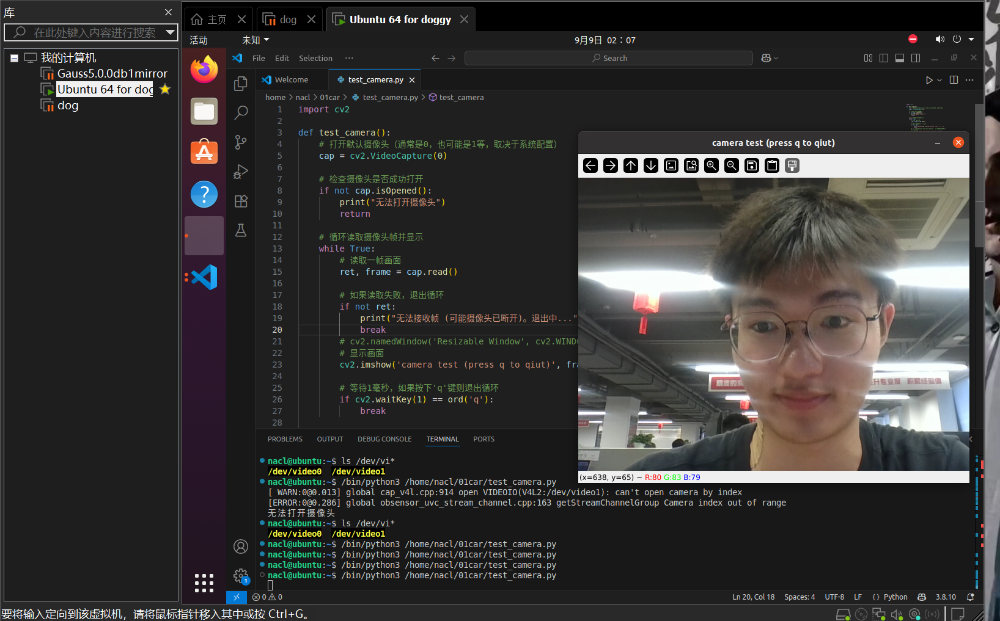
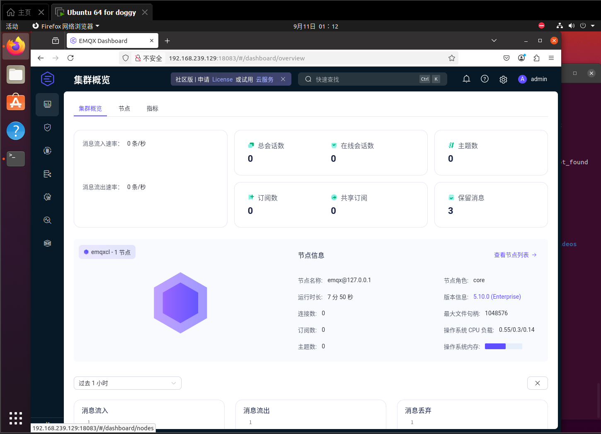
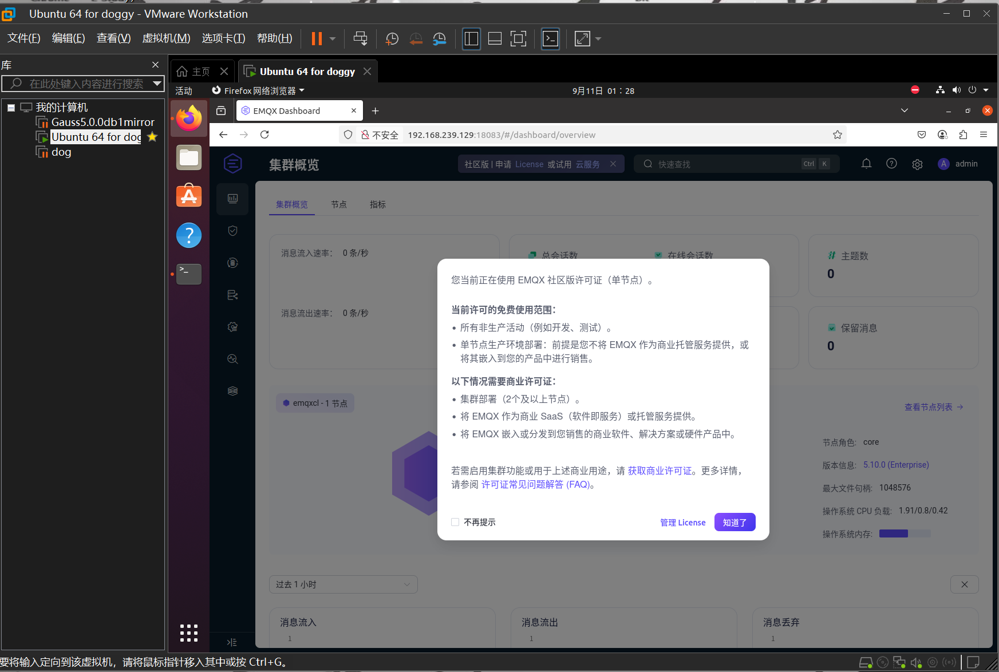
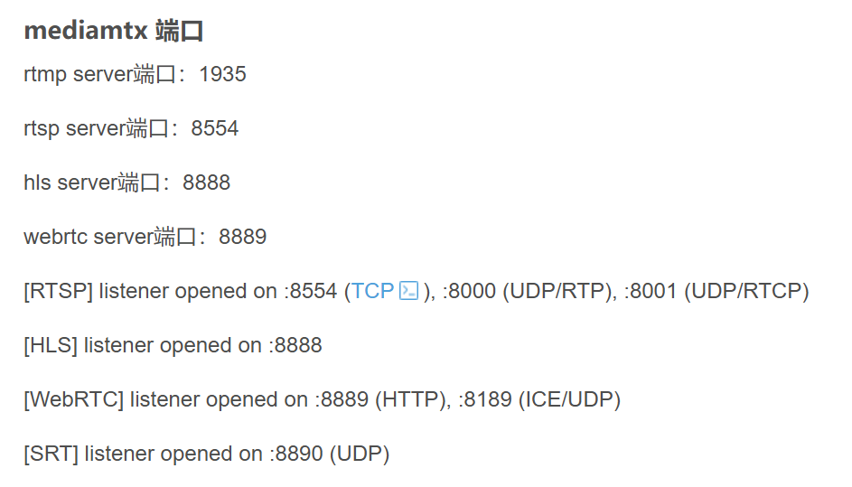

# 技术选型
- **云端**
    - 部署MQTT Broker
    - 部署RTSP服务器（这里笔者用`rtsp-simple-server`）
- **边缘端**
    - 使用`paho-mqtt`监听控制台指令
    - 接收“传输视频”指令时，使用`ffmpeg`（or`opencv + GStreamer`）推送 RTSP 流到云端，并发布 RTSP 地址
    - 接收“拍照”指令时用 `cv2.VideoCapture` 抓一帧，发送给控制台（Base64 或通过云存储 URL）
- **控制端**
    - 使用`paho-mqtt`发布控制指令
    - 使用`opencv`播放 RTSP 流

# 初代代码
## 机器狗 robot.py
```python
import time
import base64
import cv2
import paho.mqtt.client as mqtt
import subprocess
import signal
import os

BROKER = "test.mosquitto.org"   # 公共测试服务器，后续换成云端 IP
PORT = 1883
KEEPALIVE = 60

# 推流目标地址（假设你的 RTSP 服务器地址）
RTSP_URL = None

ffmpeg_process = None  # 保存 ffmpeg 子进程句柄


def start_ffmpeg_stream():
    """启动 ffmpeg，将本机摄像头推送到 RTSP 服务器"""
    global ffmpeg_process

    if ffmpeg_process is not None:
        print("[机器人] 推流已经在进行中")
        return

    # Linux 摄像头: v4l2
    # Windows 摄像头: dshow -i video="你的摄像头名称"
    cmd = [
        "ffmpeg",
        "-f", "v4l2",          # Linux 摄像头输入
        "-i", "/dev/video0",   # 摄像头设备路径
        "-s", "640x360",       # 分辨率
        "-b:v", "800k",        # 码率
        "-f", "rtsp",          # 输出格式
        RTSP_URL               # 推流地址
    ]

    try:
        ffmpeg_process = subprocess.Popen(cmd, stdout=subprocess.DEVNULL, stderr=subprocess.DEVNULL)
        print(f"[机器人] ffmpeg 推流进程已启动，推送到 {RTSP_URL}")
    except Exception as e:
        print(f"[机器人] 启动 ffmpeg 失败: {e}")


def stop_ffmpeg_stream():
    """停止 ffmpeg 推流"""
    global ffmpeg_process
    if ffmpeg_process is not None:
        os.kill(ffmpeg_process.pid, signal.SIGTERM)
        ffmpeg_process = None
        print("[机器人] 已停止 ffmpeg 推流")


def on_message(client, userdata, msg):
    command = msg.payload.decode()
    print(f"[机器人] 收到指令: {command}")

    if command == "start_video":
        start_ffmpeg_stream()
        # 回复 RTSP 地址
        client.publish("dog/001/resp/video", RTSP_URL)

    elif command == "stop_video":
        stop_ffmpeg_stream()

    elif command == "take_photo":
        cap = cv2.VideoCapture(0)
        ret, frame = cap.read()
        cap.release()
        if ret:
            _, buffer = cv2.imencode(".jpg", frame)
            photo_b64 = base64.b64encode(buffer).decode("utf-8")
            client.publish("dog/001/resp/photo", photo_b64)
            print("[机器人] 上传当前照片")
        else:
            print("[机器人] 拍照失败")


def main():
    client = mqtt.Client("robot001")
    client.on_message = on_message

    print("[机器人] 连接到 MQTT Broker...")
    client.connect(BROKER, PORT, KEEPALIVE)

    # 订阅控制指令
    client.subscribe("dog/001/cmd")

    try:
        client.loop_forever()
    except KeyboardInterrupt:
        stop_ffmpeg_stream()
        print("[机器人] 退出")


if __name__ == "__main__":
    main()


```
## 控制台 control.py
```python
import time
import base64
import cv2
import numpy as np
import paho.mqtt.client as mqtt
import threading

BROKER = "test.mosquitto.org"   # 公共测试服务器
PORT = 1883
KEEPALIVE = 60

rtsp_url = None
playing = False

def play_rtsp(rtsp_url):
    """用 OpenCV 播放 RTSP 流"""
    global playing
    cap = cv2.VideoCapture(rtsp_url)

    if not cap.isOpened():
        print(f"[错误] 无法打开 RTSP 流: {rtsp_url}")
        return

    print(f"[控制中心] 正在播放 RTSP 视频流: {rtsp_url} 按 q 退出")
    playing = True

    while playing:
        ret, frame = cap.read()
        if not ret:
            print("[警告] 读取帧失败，可能是网络抖动")
            break

        cv2.imshow("Robot RTSP Stream", frame)

        if cv2.waitKey(1) & 0xFF == ord('q'):
            playing = False
            break

    cap.release()
    cv2.destroyAllWindows()
    playing = False


def on_message(client, userdata, msg):
    global rtsp_url, playing

    if msg.topic == "dog/001/resp/video":
        rtsp_url = msg.payload.decode()
        print(f"[控制中心] 收到机器人 RTSP 地址: {rtsp_url}")
        if not playing:
            threading.Thread(target=play_rtsp, args=(rtsp_url,), daemon=True).start()

    elif msg.topic == "dog/001/resp/photo":
        print("[控制中心] 收到照片")
        photo_data = base64.b64decode(msg.payload)
        np_arr = np.frombuffer(photo_data, np.uint8)
        frame = cv2.imdecode(np_arr, cv2.IMREAD_COLOR)
        cv2.imshow("Robot Photo", frame)
        cv2.waitKey(3000)  # 显示 3 秒
        cv2.destroyWindow("Robot Photo")


def main():
    client = mqtt.Client("control001")
    client.on_message = on_message

    print("[控制中心] 连接到 MQTT Broker...")
    client.connect(BROKER, PORT, KEEPALIVE)

    # 订阅机器人响应
    client.subscribe("dog/001/resp/video")
    client.subscribe("dog/001/resp/photo")

    client.loop_start()

    # 下发测试指令
    time.sleep(2)
    client.publish("dog/001/cmd", "start_video")   # 让机器人推流

    time.sleep(10)
    client.publish("dog/001/cmd", "take_photo")   # 抓一张照片

    # 保持运行
    while True:
        time.sleep(1)


if __name__ == "__main__":
    main()
```

# test devices
基于现有无服务器、无资金、无设备的“三无”条件，笔者要使用
1. 公共 MQTT Broker：`broker.emqx.io` or 私有部署的 EMQX 服务器`http://192.168.239.129:18083`
2. 私有 RTSP 服务器：`rtsp-simple-server`，部署于本人的虚拟机中
3. 摄像头：笔者使用笔记本自带摄像头

# 测试角色分工
- 虚拟机一个终端 -> 机器狗（robot.py）：模拟机器狗，连接摄像头，推送 RTSP 流
- 本地电脑一个终端 -> 控制台（control.py）：模拟控制台，发布指令，接收 RTSP 地址和照片
- 虚拟机开启`rtsp-simple-server`，监听RTSP请求

# 部署
需要先安装 Paho MQTT Python 库，可以使用 pip：
```bash
pip install -r requirements.txt
```
聪明的你当然可以使用anaconda来管理本项目的环境
```bash
conda create -n mqtt_demo python=3.8
conda activate mqtt_demo
pip install -r requirements.txt
```
## 配置虚拟摄像头
- 终端中安装opencv
    ```bash
    pip install opencv-python
    ```
- 调试虚拟机摄像头
参考https://blog.csdn.net/u012005313/article/details/82146385
使用测试例程
    ```python
    import cv2

    def test_camera():
        # 打开默认摄像头（通常是0，也可能是1等，取决于系统配置）
        cap = cv2.VideoCapture(0)
        
        # 检查摄像头是否成功打开
        if not cap.isOpened():
            print("无法打开摄像头")
            return
        
        # 循环读取摄像头帧并显示
        while True:
            # 读取一帧画面
            ret, frame = cap.read()
            
            # 如果读取失败，退出循环
            if not ret:
                print("无法接收帧 (可能摄像头已断开)。退出中...")
                break
            
            # 显示画面
            cv2.imshow('camera test (press q to quit)', frame)

            # 等待1毫秒，如果按下'q'键则退出循环
            if cv2.waitKey(1) == ord('q'):
                break
        
        # 释放摄像头资源
        cap.release()
        # 关闭所有OpenCV窗口
        cv2.destroyAllWindows()

    if __name__ == "__main__":
        test_camera()
    ``` 

- 如果出现

**即本机摄像头调试完成**

## 部署MQTT服务器
### 安装
**按照[EMQX官方的“使用 Apt 包管理器安装”](https://docs.emqx.com/zh/emqx/latest/deploy/install-ubuntu.html)进行部署**
其中要将
```bash
sudo apt-get install emqx
```
更改为
```bash
sudo apt-get install emqx-enterprise
```
这里也不知道为什么官方的包名称没有加上企业版，莫非有社区版？但是也没看到
在启动EMQX服务后
```bash
sudo systemctl start emqx
```
### 测试
- 通过浏览器访问 http://localhost:18083/（localhost 可替换为您的实际 IP 地址笔者虚拟机为http://192.168.239.129:18083/）以访问 EMQX Dashboard 管理控制台，进行设备连接与相关指标监控管理。

- 默认用户名及密码：
`admin`
`public`
- 初次登陆需要修改密码

**出现**

可见应该部署成功，但是目前为免费测试用，有如下提示：

- 停止服务使用
```bash
sudo systemctl stop emqx
```

## 部署RTSP服务器

### 安装
- 安装 `mediamtx服务器（原rtsp-simple-server)`
```bash
wget https://github.com/bluenviron/mediamtx/releases/download/v1.9.3/mediamtx_v1.9.3_linux_amd64.tar.gz
```
- 解压
```bash
mkdir mediamtx1
tar -xvzf /home/nacl/mediamtx_v1.9.3_linux_amd64.tar.gz -C /home/nacl/mediamtx1
```
- 运行
```bash
cd mediamtx1
./mediamtx
```
**出现**
```bash
025/09/11 02:10:24 INF MediaMTX v1.9.3
2025/09/11 02:10:24 INF configuration loaded from /home/nacl/mediamtx1/mediamtx.yml
2025/09/11 02:10:24 INF [RTSP] listener opened on :8554 (TCP), :8000 (UDP/RTP), :8001 (UDP/RTCP)
2025/09/11 02:10:24 INF [RTMP] listener opened on :1935
2025/09/11 02:10:24 INF [HLS] listener opened on :8888
2025/09/11 02:10:24 INF [WebRTC] listener opened on :8889 (HTTP), :8189 (ICE/UDP)
2025/09/11 02:10:24 INF [SRT] listener opened on :8890 (UDP)
^C2025/09/11 02:11:08 INF shutting down gracefully
2025/09/11 02:11:08 INF [SRT] listener is closing
2025/09/11 02:11:08 INF [WebRTC] listener is closing
2025/09/11 02:11:08 INF [HLS] listener is closing
2025/09/11 02:11:08 INF [RTMP] listener is closing
2025/09/11 02:11:08 INF [RTSP] listener is closing
2025/09/11 02:11:08 INF waiting for running hooks
```
即表示完成

# 运行
## 打开MQTT服务器
```bash
sudo systemctl start emqx
```
- 在控制台浏览器中输入[192.168.239.129:18083](192.168.239.129:18083)即可监控当前MQTT服务器状态
## 打开RTSP服务器
  - 新建一个终端，进入到mediamtx文件夹，打开服务
  ```bash
  cd mediamtx1
  ./mediamtx
  ```
## 配置各个服务器在py文件中的地址以及端口
将各个地址改成你自己的服务器

## 先后运行`robot.py`和`control.py`
经2025.9.12测试，传输照片功能正常
**但视频传输会有**
```
[控制中心] 连接到 MQTT Broker...
[控制中心] 收到机器人 RTSP 地址: rtsp://192.168.239.129:8554/dog001
[rtsp @ 000002ae944f3000] method DESCRIBE failed: 404 Not Found
[错误] 无法打开 RTSP 流: rtsp://192.168.239.129:8554/dog001
```
**无法打开推流地址**
但用
```bash
nacl@ubuntu:~$ ffplay rtsp://127.0.0.1:8554/dog001
```
本地回环可以得到画面
**chatgpt告诉我是：**
```
结合你现在的情况，很可能是 网络层面的问题：

Windows 客户端无法访问 Linux IP

Windows 用的是 192.168.239.1，Linux 推流端是 192.168.239.129。

如果是在虚拟机里跑 Linux，要确保网络设置是 桥接模式 或 Host-Only，这样 Windows 才能直接访问 Linux IP。

NAT 模式下，外部 Windows 默认访问不到虚拟机内部 IP
```
# TODO
<!-- ✔️完成 -->
| task | status |
|---|---|
|机器狗摄像头模拟|✔️完成|
|RTSP服务器部署|✔️完成|
|机器狗ffmpeg推流|✔️完成|

